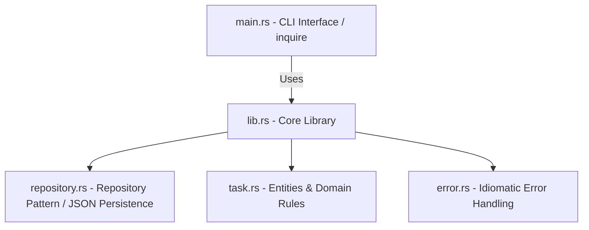

# TaskManager

*(Choose your language / Escolha seu idioma)*<br>
[](https://github.com/HenriqueSHA/TaskManeger/blob/main/README.md)
[](https://github.com/HenriqueSHA/TaskManeger/blob/main/README.pt-BR.md)

---

[](https://github.com/HenriqueSHA/TaskManeger/actions/workflows/rust-ci.yml)
[](https://github.com/HenriqueSHA/TaskManeger/blob/main/LICENSE)

An interactive, modern command-line interface (CLI) application built in Rust for managing personal tasks (To-Do). It features persistent storage in a JSON file, clean architecture using the Repository pattern, advanced interactive prompts, automated CI/CD pipelines, and multi-stage Docker support.

## Table of Contents
- [About the Project](#about-the-project)
- [Key Features](#key-features)
- [Architecture and Technologies](#architecture-and-technologies)
- [Code Structure](#code-structure)
- [Installation and Usage](#installation-and-usage)
- [CI/CD & Docker](#cicd--docker)
- [Author and License](#author-and-license)

---

## About the Project
**TaskManager** has been designed following best practices of production-grade Rust software engineering, focusing on high cohesion, loose coupling, and idiomatic error handling. It has evolved from a simple in-memory CLI to a professional CLI tool with durable persistence, serving as a robust portfolio showcase demonstrating traits, lifecycle tracking (timestamps using `chrono`), data serialization (`serde`), and integration tests.

## Key Features
* **Premium Interactive UI:** Replaced manual terminal inputs with rich selection menus using arrow keys via the `inquire` crate.
* **Persistent Storage:** Automatically saves and loads tasks to/from a local `tasks.json` file.
* **Dynamic Color-Coded Statuses:** Visually appealing rendering of task statuses (`Pendente`, `Em Andamento`, `Concluído`) using ANSI coloring via the `colored` crate.
* **Traceable Lifecycles:** Real-time recording of `criada_em` (created at) and `atualizada_em` (updated at) timestamps on every state transition.
* **Safe Deletions:** Double-check confirmation prompts before removing tasks.

---

## Architecture and Technologies

The project's architecture implements **Clean Architecture** patterns, divided into well-structured layers:



| Layer / Component | Technology / Crate | Description / Usage |
| :--- | :--- | :--- |
| **Domain Models** | Rust (`task.rs`) | Domain entities `Task` and `Status` with timestamps. |
| **Repository Pattern** | Rust (`repository.rs`) | Abstraction `TaskRepository` and concrete `JsonFileRepository` implementation. |
| **Error Handling** | `thiserror` (`error.rs`) | Custom typed errors represented idiomatically in Rust. |
| **Interface (Frontend)** | `inquire` & `colored` | Arrow-key menu navigation and colored terminal formatting. |
| **Persistence** | `serde` & `serde_json` | Serialization of Rust structures to and from JSON files. |

---

## Code Structure

```text
├── Cargo.toml
├── Dockerfile
├── tasks.json (Auto-generated)
├── .github
│   └── workflows
│       └── rust-ci.yml
└── src
    ├── error.rs      # Custom error handling (TaskError)
    ├── lib.rs        # Library crate module declarations
    ├── main.rs       # Executable entry point
    ├── repository.rs # Repository trait & JSON file operations
    └── task.rs       # Domain Task & Status models
```

---

## Installation and Usage

### Prerequisites
* Rust toolchain (rustup and cargo package manager) v1.75+

### Local Execution
1. Clone the repository:
   ```bash
   git clone git@github.com:HenriqueSHA/TaskManeger.git
   cd TaskManeger
   ```
2. Run the application directly with Cargo:
   ```bash
   cargo run
   ```
3. Run the automated unit tests:
   ```bash
   cargo test
   ```

---

## CI/CD & Docker

### Continuous Integration (GitHub Actions)
The pipeline configured in `.github/workflows/rust-ci.yml` runs automatically on pushes and pull requests:
* Code formatting check (`cargo fmt --check`)
* Static code analysis with Rust's linter (`cargo clippy`)
* Test suite execution (`cargo test`)

### Docker
You can also package and run the application in a multi-stage Docker container, which keeps the production image extremely small:

1. Build the Docker image locally:
   ```bash
   docker build -t taskmanager:latest .
   ```
2. Run the application interactively via Docker:
   ```bash
   docker run -it --rm -v $(pwd)/tasks.json:/app/tasks.json taskmanager:latest
   ```
   *(Note: The `-v` parameter binds `tasks.json` from the host system to persist your tasks locally)*

---

## Author and License
Developed by **[Henrique Albergaria Santos](https://www.linkedin.com/in/henriquealbergaria/)**.

Distributed under the MIT License. See `LICENSE` for more details.
