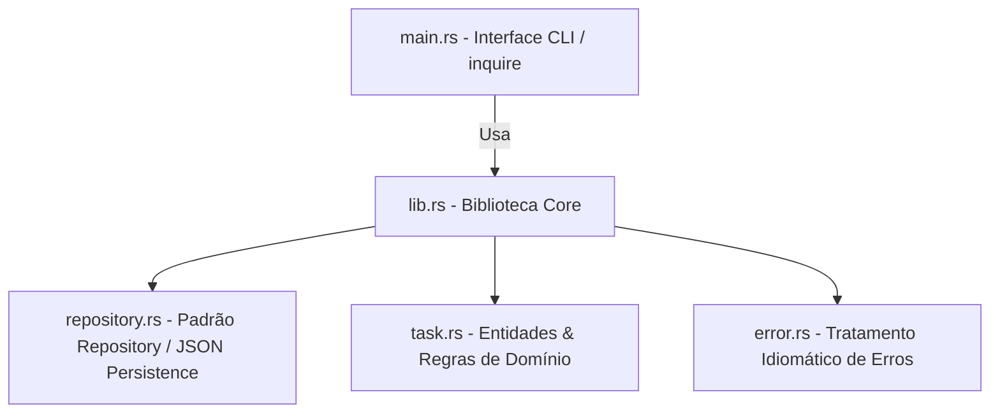

# TaskManager

*(Choose your language / Escolha seu idioma)*<br>
[](https://github.com/HenriqueSHA/TaskManeger/blob/main/README.md)
[](https://github.com/HenriqueSHA/TaskManeger/blob/main/README.pt-BR.md)

---

[](https://github.com/HenriqueSHA/TaskManeger/actions/workflows/rust-ci.yml)
[](https://github.com/HenriqueSHA/TaskManeger/blob/main/LICENSE)

Aplicação interativa e moderna em linha de comando (CLI) desenvolvida em Rust para gerenciamento de tarefas pessoais (To-Do). Conta com persistência de dados em arquivo JSON, arquitetura limpa utilizando o padrão Repository, menus interativos avançados, pipeline de CI/CD automatizado e suporte para execução em Docker.

## Sumário
- [Sobre o Projeto](#sobre-o-projeto)
- [Principais Funcionalidades](#principais-funcionalidades)
- [Arquitetura e Tecnologias](#arquitetura-e-tecnologias)
- [Estrutura do Código](#estrutura-do-código)
- [Instalação e Uso](#instalação-e-uso)
- [CI/CD & Docker](#cicd--docker)
- [Autor e Licença](#autor-e-licença)

---

## Sobre o Projeto
O **TaskManager** foi projetado seguindo as melhores práticas de desenvolvimento em Rust, focado em alta coesão, baixo acoplamento e tratamento seguro de erros. Ele evoluiu de um simples CLI básico em memória para uma ferramenta profissional com persistência duradoura, servindo de portfólio robusto sobre o uso de traits, gerenciamento de ciclo de vida (timestamps com `chrono`), serialização de dados (`serde`), e testes de integração automatizados.

## Principais Funcionalidades
* **Interface Interativa Premium:** Substituição do fluxo de leitura manual por menus de seleção ricos com setas direcionais via crate `inquire`.
* **Persistência de Dados:** Salva e carrega tarefas automaticamente do arquivo local `tasks.json`.
* **Status com Cores Dinâmicas:** Exibição elegante do progresso das tarefas no terminal (`Pendente`, `Em Andamento`, `Concluído`) com formatação ANSI via crate `colored`.
* **Rastreabilidade Temporal:** Registro de carimbos de data/hora (`criada_em` e `atualizada_em`) em cada alteração de status.
* **Remoção Segura:** Exclusão interativa com prompt de confirmação de segurança (Confirm).

---

## Arquitetura e Tecnologias

A arquitetura do projeto segue o padrão **Clean Architecture**, dividida em camadas bem definidas:



| Camada / Componente | Tecnologia / Crate | Descrição / Uso |
| :--- | :--- | :--- |
| **Domain Models** | Rust (`task.rs`) | Estruturas de dados `Task` e `Status` com timestamps. |
| **Repository Pattern** | Rust (`repository.rs`) | Abstração `TaskRepository` e implementação `JsonFileRepository` para persistência. |
| **Error Handling** | `thiserror` (`error.rs`) | Erros customizados e tipados de forma idiomática em Rust. |
| **Interface (Frontend)** | `inquire` & `colored` | Navegação por menus e interações coloridas no terminal. |
| **Persistência** | `serde` & `serde_json` | Conversão de objetos Rust em arquivos JSON e vice-versa. |

---

## Estrutura do Código

```text
├── Cargo.toml
├── Dockerfile
├── tasks.json (Gerado automaticamente)
├── .github
│   └── workflows
│       └── rust-ci.yml
└── src
    ├── error.rs      # Tratamento de erros customizados (TaskError)
    ├── lib.rs        # Exposição da biblioteca e API pública
    ├── main.rs       # Ponto de entrada do executável da aplicação
    ├── repository.rs # Definição da trait Repository e escrita/leitura em arquivo JSON
    └── task.rs       # Entidade de domínio Task e Status
```

---

## Instalação e Uso

### Pré-requisitos
* Rust (ferramenta `rustup` e gerenciador de pacotes `cargo`) v1.75+

### Execução Local
1. Clone o repositório:
   ```bash
   git clone git@github.com:HenriqueSHA/TaskManeger.git
   cd TaskManeger
   ```
2. Execute a aplicação diretamente pelo Cargo:
   ```bash
   cargo run
   ```
3. Rode os testes unitários da aplicação:
   ```bash
   cargo test
   ```

---

## CI/CD & Docker

### Integração Contínua (GitHub Actions)
O pipeline configurado em `.github/workflows/rust-ci.yml` executa as seguintes etapas a cada push/pull request:
* Validação de formatação (`cargo fmt --check`)
* Análise estática com linter do Rust (`cargo clippy`)
* Execução de testes automatizados (`cargo test`)

### Docker
Você também pode empacotar e rodar a aplicação em um container Docker de múltiplos estágios (multi-stage build), o que minimiza o tamanho da imagem de produção:

1. Construir a imagem Docker localmente:
   ```bash
   docker build -t taskmanager:latest .
   ```
2. Rodar a aplicação de forma interativa pelo Docker:
   ```bash
   docker run -it --rm -v $(pwd)/tasks.json:/app/tasks.json taskmanager:latest
   ```
   *(Nota: O parâmetro `-v` permite que o arquivo `tasks.json` persista os dados diretamente em sua máquina local)*

---

## Autor e Licença
Desenvolvido por **[Henrique Albergaria Santos](https://www.linkedin.com/in/henriquealbergaria/)**.

Distribuído sob a licença MIT. Veja `LICENSE` para mais informações.
